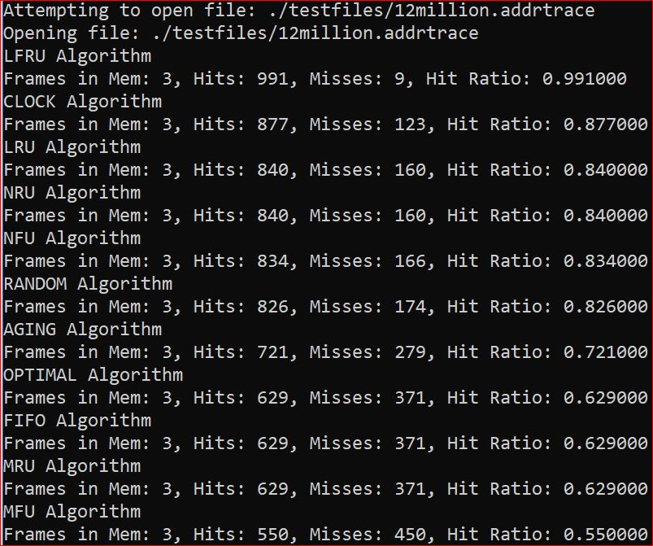
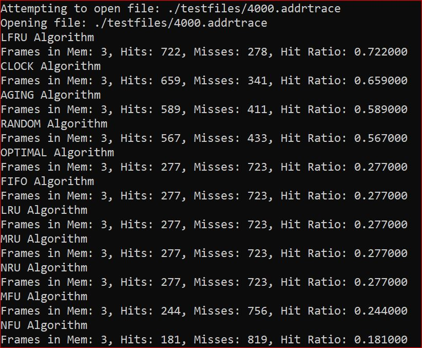
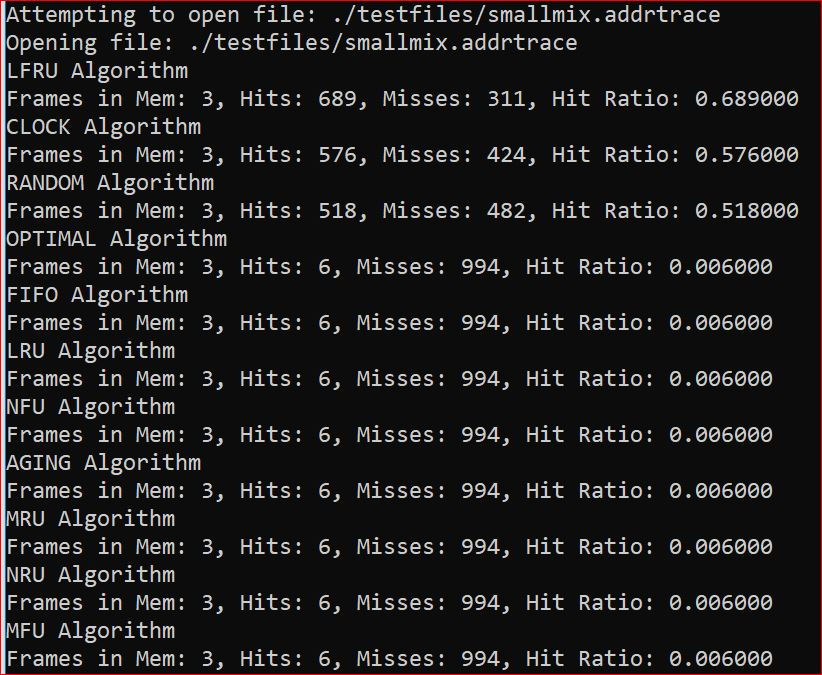

# Cache-replacement-policies
Cache replacement policies in C
This repository contains a comprehensive implementation of various cache replacement algorithms written in C. These algorithms play a crucial role in operating systems for managing pages in memory. The project is designed primarily for educational purposes, aiming to provide insight into how different page replacement strategies function under varying circumstances.

## Algorithms Implemented

- Optimal Page Replacement
- Random Page Replacement
- First-In, First-Out (FIFO)
- Least Recently Used (LRU)
- Clock Replacement
- Not Frequently Used (NFU)
- Aging
- Most Recently Used (MRU)
- Not Recently Used (NRU)
- Most Frequently Used (MFU)
- Least Frequently Recently Used (LFRU)

Each algorithm employs its unique approach to determine which page to evict when a page fault occurs, offering various efficiency levels based on the specific use case.

## Features

- Comprehensive implementation of 11 different page replacement strategies.
- Configurable settings for the number of frames, page reference size, and the total number of page calls.
- Debugging and verbose output options for in-depth analysis.
- Custom LFRU algorithm implementation demonstrating a hybrid approach.

## Usage

1. Clone the repository:
Clone the repository: git clone https://github.com/EthanCornell/Cache-replacement-policies.git

2. Navigate to the project directory:
cd page-replacement-algorithms

4. Compile the source code:
gcc main.c -o page_replacement

5. Run the program:
./page_replacement [input file] [algorithm] [num_frames] [show_process] [debug]

Replace `[input file]`, `[algorithm]`, `[num_frames]`, `[show_process]`, and `[debug]` with your preferred settings.

# Cache Replacement Algorithm Execution Results

This section presents the execution results of various page replacement algorithms. These results were obtained under a test environment with specific conditions described below.

## Test Environment

- Number of frames in memory: 3
- Number of page references: Varies per test file
- Test files used:
  - `12million.addrtrace`
  - `4000.addrtrace`
  - `smallmix.addrtrace`

## Results

The following results showcase the number of hits, misses, and the hit ratio achieved by each algorithm when tested with different trace files.

### Results for `12million.addrtrace`

### Results for `4000.addrtrace`

### Results for `smallmix.addrtrace`

## Interpretation

These results indicate that the LFRU algorithm consistently outperforms other algorithms in terms of hit ratio across different test traces.

## Contributing

Contributions to enhance or extend the functionality of this project are welcome. Please feel free to fork the repository, make changes, and submit a pull request.

### License:
This project is licensed under the GNU General Public License v3.0 - see the [LICENSE](LICENSE) file for details.

